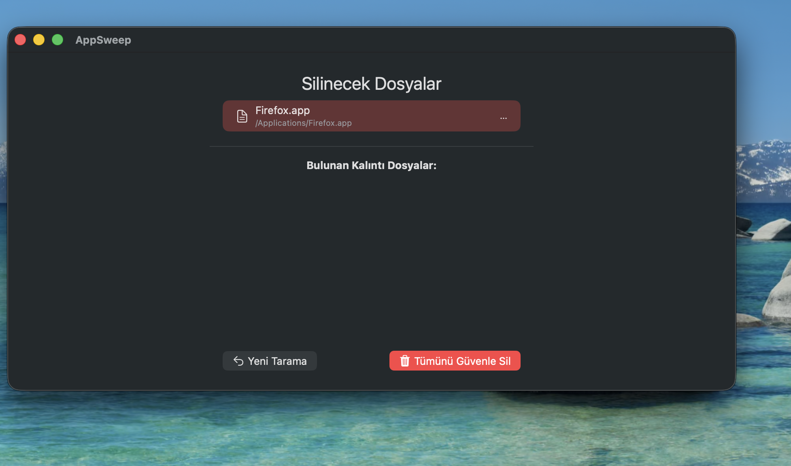

# AppSweep (Çalışma Adı)

AppSweep, macOS uygulamalarını ve geride bıraktıkları *tüm* kalıntı dosyalarını (Ayarlar, Önbellek, Destek dosyaları) tek bir tıklamayla, güvenli bir şekilde kaldıran bir yardımcı programdır.

Bu proje, bir backend geliştiricisinin (Java/TypeScript) Swift ve SwiftUI dünyasına geçiş yolculuğunu belgelemektedir.

---

## 🚀 Temel Özellikler (MVP v1.0)

* **Sürükle ve Bırak:** Uygulamaları analiz etmek için ana pencereye sürükleyin.
* **Akıllı Kalıntı Tespiti:** Uygulamanın "parmak izini" (Bundle ID) ve adını kullanarak sistem genelindeki ilişkili dosyaları bulur.
* **Reaktif Sonuç Ekranı:** Tarama bittiği anda, ana uygulamayı ve bulunan tüm kalıntı dosyalarını bir liste halinde gösterir.
* **Yeni Tarama:** Tek bir butonla mevcut sonucu temizleyip ana "Sürükle-Bırak" ekranına dönme.
* **Güvenli Kalıntı Silme:** Bulunan *kalıntı* dosyalarını Çöp Sepeti'ne güvenle taşır. (Ana uygulama dosyası için Admin yetkisi gerektiren silme özelliği v1.1'e ertelenmiştir).

## 🛠️ Teknik Altyapı

* **Dil:** Swift
* **Arayüz (UI):** SwiftUI (Deklaratif, modern UI)
* **Mimari Desen:** MVVM (Model-View-ViewModel)
* **Çeklek API'ler:**
    * `Foundation` (Dosya işlemleri için `FileManager`, `Bundle`)
    * `Combine` (ViewModel ve View arasında reaktif veri akışı için)
    * `UniformTypeIdentifiers` (Modern sürükle-bırak dosya tipleri için)

## 💻 Geliştirme İçin Çalıştırma

1.  Projeyi Xcode'da açın.
2.  `AppSweep` Proje ayarlarına gidin -> "Signing & Capabilities" sekmesi.
3.  **"App Sandbox"** yeteneğinin **kaldırıldığından** emin olun. (Uygulamanın gerçek `~/Library` klasörüne erişebilmesi için bu gereklidir).
4.  Sol üstteki Oynat (▶) butonuna basarak uygulamayı çalıştırın.

---

### 🎉 MVP v1.0 Başarıyla Tamamlandı! (Başarı Kanıtı)

Projemizin ilk aşaması olan "Minimum Viable Product" (MVP v1.0) başarıyla tamamlanmıştır. Uygulama, kullanıcının sürüklediği bir uygulamanın geride bıraktığı *kalıntı* dosyalarını tespit edebiliyor ve bunları güvenle Çöp Sepeti'ne taşıyabiliyor.

**Test Senaryosu:** Mozilla Firefox uygulaması kullanılarak yapılmış, tema ve eklentilerle aktif olarak kullanıldıktan sonra AppSweep ile taranmıştır.

#### 1. AppSweep Arayüzü: Kalıntılar Tespit Edildi ve Başarıyla Silindi

Arayüz, `Firefox.app` uygulamasını ve bulunan kalıntı dosyalarını başarıyla listeledi. "Tümünü Güvenle Sil" butonuna basıldıktan sonra kalıntı listesi arayüzden kayboldu, ana uygulama ise kullanıcının manuel olarak silebilmesi için ekranda bırakıldı (çünkü ana uygulama silme yetkisi v1.1'e ertelendi).



<br>

#### 2. Konsol Çıktısı: Kalıntılar Doğru Tespit Edildi ve Hata Olmadan Silindi

Konsol çıktıları, `Firefox.app`'in `Bundle ID`'sinin (`org.mozilla.firefox`) başarıyla bulunduğunu, `Application Support`, `Caches` ve `Preferences` klasörlerinde `3 adet kalıntı dosya` tespit edildiğini ve bunların "İzin Hatası" almadan başarıyla Çöp Sepeti'ne taşındığını göstermektedir.

```bash
--- ViewModel İşlemi Başlattı ---
🎉 Başarı! Uygulamanın parmak izi bulundu: org.mozilla.firefox
Aranıyor: /Users/cagriseyhan/Library/Application Support
--> Bulundu: Firefox
Aranıyor: /Users/cagriseyhan/Library/Caches
--> Bulundu: Firefox
Aranıyor: /Users/cagriseyhan/Library/Preferences
--> Bulundu: org.mozilla.firefox.plist
Aranıyor: /Users/cagriseyhan/Library/Logs
Aranıyor: /Users/cagriseyhan/Library/Saved Application State
--- Arama Tamamlandı ---
3 adet kalıntı dosya bulundu.
--- Silme İşlemi Başlatıldı (Sadece Kalıntılar) ---
Başarıyla çöpe taşındı: Firefox
Başarıyla çöpe taşındı: Firefox
Başarıyla çöpe taşındı: org.mozilla.firefox.plist
--- Silme İşlemi Tamamlandı ---
3 / 3 kalıntı dosya çöpe taşındı.

### Sonraki Adım

README dosyamız artık projemizin başarısını doğru ve profesyonel bir şekilde belgeliyor.

MVP'mizi tamamladık ve belgeledik.

Şimdi, `README-Roadmap.md` dosyamızda v1.1 olarak tanımladığımız, projemizin en karmaşık ama en önemli özelliği olan **Ayrıcalıklı Silme (Helper Tool)** mimarisini kurmaya başlamaya hazır mısınız?
